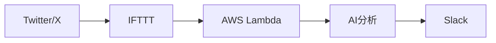

# TwikeChanneler

## 概要

ツイッター(現 X)上でいいねしたポストを Slack で通知する AWS Lambda 関数です。
投稿の内容を分析し、適切な Slack チャンネルに自動的に振り分けて通知を行います。

## 特徴

- IFTTT 経由で Twitter のいいねを検知
- AWS Lambda によるサーバーレスアーキテクチャ
- 投稿内容に基づく自動チャンネル振り分け
- シンプルな設定で簡単に導入可能

## システム構成



### 使用技術

- AWS Lambda
- Python 3.9
- AWS SAM (Serverless Application Model)
- IFTTT
- Slack API

## セットアップ

### 前提条件

- AWS アカウント
- IFTTT アカウント
- Slack ワークスペースの管理者権限
- Python 3.9 以上
- AWS SAM CLI

### インストール手順

1. リポジトリのクローン

```bash
git clone https://github.com/yourusername/TwikeChanneler.git
cd TwikeChanneler
```

2. 依存関係のインストール

```bash
sam build
```

3. 環境変数の設定

```bash
cp .env.example .env
# .envファイルに必要な環境変数を設定
```

4. デプロイ

```bash
sam deploy --guided
```

## 開発状況

### 完了した機能

- [x] 基本的な Lambda 関数の構築
- [x] CICD パイプラインの構築
- [x] 基本的なログ出力機能

### 開発中の機能

- [ ] IFTTT 連携機能
- [ ] Slack 通知機能
- [ ] AI 分析による投稿の分類
- [ ] チャンネル振り分けロジック

## コントリビューション

プルリクエストは大歓迎です。大きな変更を加える場合は、まず issue を作成して変更内容を議論しましょう。

## ライセンス

[MIT ライセンス](LICENSE)の下で公開されています。

## 作者

- niwanowa

## 謝辞

このプロジェクトは以下のオープンソースプロジェクトを使用しています：

- AWS SAM
- その他の依存ライブラリ（requirements.txt を参照）
